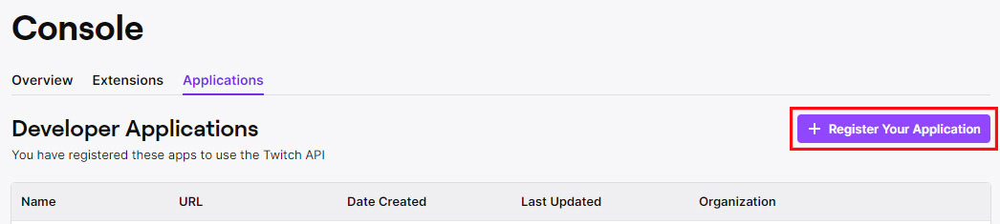
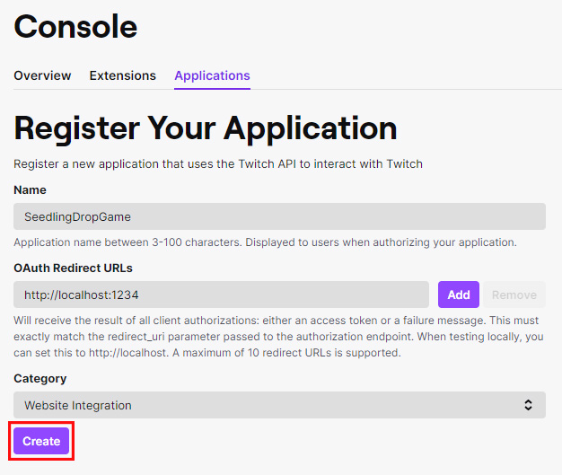
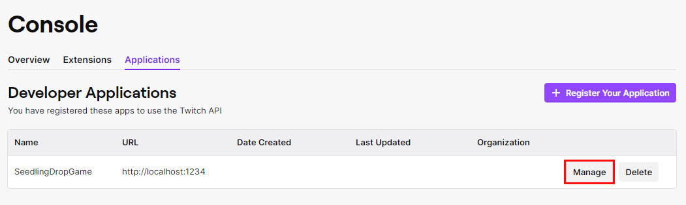

## How to get Twitch Client ID

In order to use `!drop me` feature, first you need to authorize the application to call Twitch Users API.
The authorization process requires a Client ID, here is how you can get one.

1. Go to [Twitch Developer Console](https://dev.twitch.tv/console/apps) and login with your credentials.
 

2. Click on the `Register Your Application` button.

 

3. Fill in the fields and for ***OAuth Redirect URLs*** make sure that you enter exactly the same port as you specify in your `package.json`, then click on `Create` button.

 

4. Click on `Manage` button.

 

5. Get your Client ID.

 
